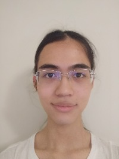
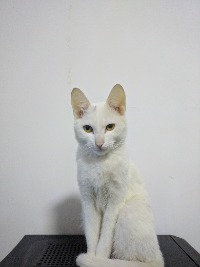

# Jiayan Dong's User Page
This is **CSE 110** Lab 1 *VSCode, Markdown, and Git* Part 1
- [Go to About me as a programmer](#about-me-as-a-programmer)  
- [Go to About me as a person](#about-me-as-a-person)  

This is a picture of me and my cat ***Fatty*** (~~Although he is not fat at all~~)

## About me as a programmer  

My name is Jiayan Dong and I'm a senior computer science student at UCSD. I'm 21 years old and I can use the following programming languages proficiently:  
- C/C++
- Java
- Python
- assembly for x86/arm
- JavaScript
- html and xml  

I have **4** years of programming experience.

I'm also interested in the following area:
1. Computer architecture
2. Machine learning and Deep learning 
3. STL in C++

## About me as a person  
In my free time, I like to:  
1. listen to music
2. read books
3. watch comic and anime
4. play video games
5. travel around

I also like to play with my cat. Here are relative links to more his cute pictures. [cat2](./images/cat2.jpg) [cat3](./images/cat3.jpg) [cat4](./images/cat4.jpg) [cat5](./images/cat5.jpg)

My favorite lyric quote is from *José González - Stay Alive*:  
> _We'll do whatever just to stay alive._  

My favorite programing language is C++:  
`std::cout << "Hello World!" << std::endl;`

This is my main [GitHub page](https://github.com/Jiayan-Dong). (external Links)

Personal goal:  
- [x] Go to university
- [x] Apply for master program
- [ ] Travel to Europe
- [ ] Find an internship
- [ ] Find a job

Contact information: [jid001@ucsd.edu](jid001@ucsd.edu) or [nonlighting@gmail.com](nonlighting@gmail.com)